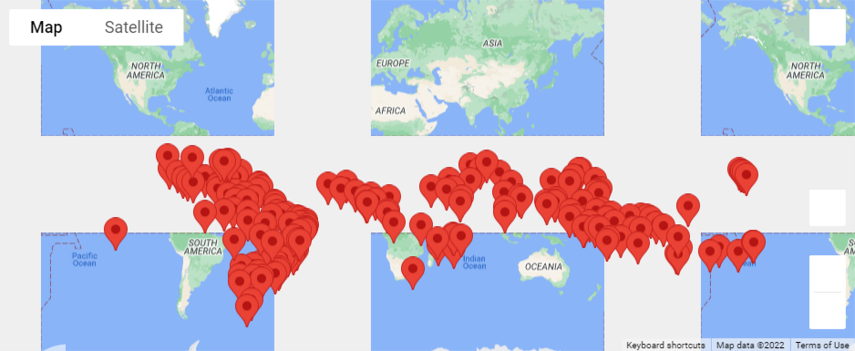
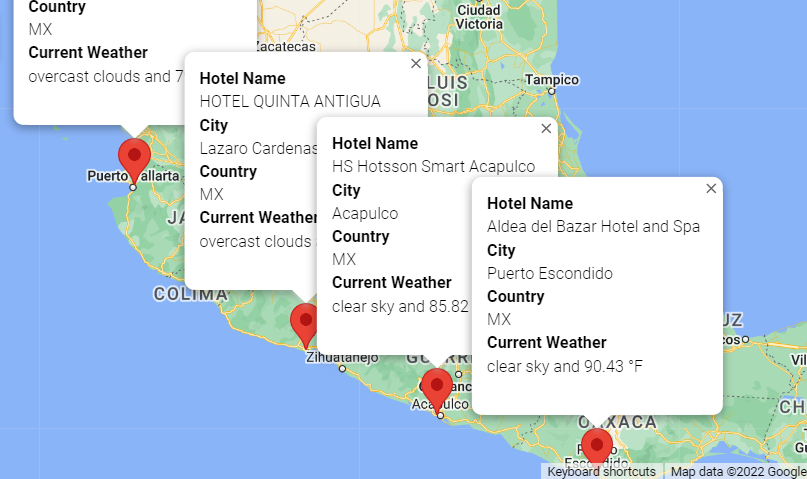
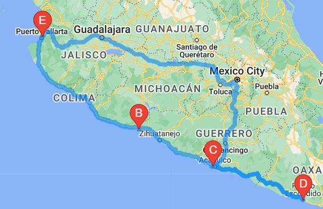

# World_Weather_Analysis

## Overview

The purpose of this analysis was to research ideal vacation spots for our client, and to provide a recommendation and itenary for the final destination(s).

## Weather Database

To initiate the analysis, a random set of 2,000 latitudes and longitudes were generated, and an API call was made on current weather data for the nearest corresponding cities. From this dataset, we were able to retreive data for 760 unique locations and further evaluate the weather including:
- Max temperature
- Percent humidity
- Percent cloudiness
- Wind speed
- Current weather description

## Vacation Search

Once the weather was better understood for each location, we were able to pinpoint a number of suitable locations and hotels for our client.

## Vacation Itinerary

After discussing options with our client they selected cities surrounding Mexico city.  Using the information we collected prior they chose four locations and we were able to provide them with a maps with markers identifing their selection including Hotel Name, City, etc as well as a map with directions to each location.

